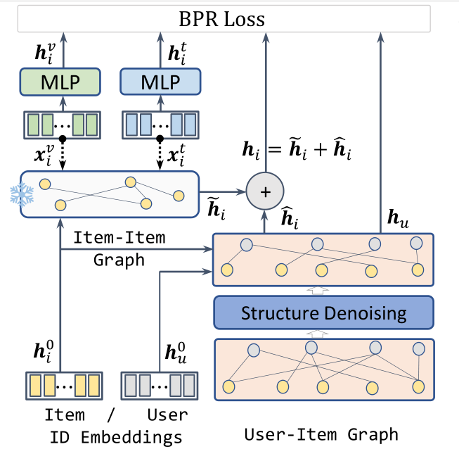

# FREEDOM
Pytorch implementation for "A Tale of Two Graphs: Freezing and Denoising Graph Structures for Multimodal Recommendation" [ACM Open Access](https://dl.acm.org/doi/10.1145/3581783.3611943).  Accepted to ACM MM'23.

- [Poster](https://xinzhou.me/resources/MM_23_Poster-Final.pdf)
- :twisted_rightwards_arrows: This model is integrated into the [MMRec](https://github.com/enoche/MMRec) framework.


## Overview of FREEDOM
<p>

</p>

## Data  
Download from Google Drive: [Baby/Sports/Clothing/etc.](https://drive.google.com/drive/folders/13cBy1EA_saTUuXxVllKgtfci2A09jyaG?usp=sharing)  
The data already contains text and image features extracted from Sentence-Transformers and CNN.  

## How to run
1. Put the H&M files under `hm` dir. This copy is configured for `hm/hm.inter`, `hm/image_feat.npy`, `hm/text_feat.npy`, and the id mappings.
2. Enter `src` folder and run with  
`python main.py -m FREEDOM -d hm`  
You may specify other parameters in CMD or config with `configs/model/*.yaml` and `configs/dataset/*.yaml`.
Early stopping is enabled by default with `stopping_step=20` on `Recall@20`.
For example: `python main.py -m FREEDOM -d hm --stopping-step 10 --early-stopping-min-delta 0.0001`.

## Run on Modal
Install the Modal CLI locally, authenticate, then run from the project root:

```bash
pip install -r requirement.txt
modal setup
modal run modal_app.py --model FREEDOM --dataset hm
```

The Modal runner uses an A100-40GB with A100-oriented defaults:
`train_batch_size=32768` and `eval_batch_size=16384`.

For a short smoke test:

```bash
modal run modal_app.py --epochs 1
```

To override the A100 batch sizes:

```bash
modal run modal_app.py --train-batch-size 65536 --eval-batch-size 16384
```

Training outputs are copied to the Modal Volume named `freedom-runs`.

---
No commercial use. License reserved by authors.
