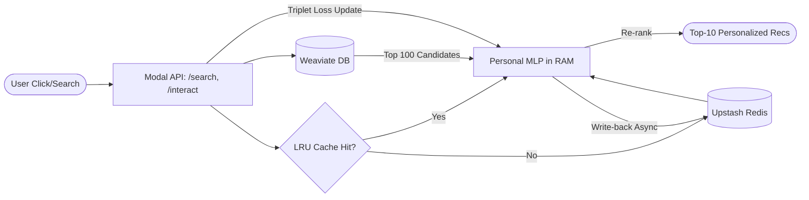

# Real-time fashion recommender system

## 1. Mục tiêu & Ràng buộc Kỹ thuật (Engineering Constraints)
- **Kiến trúc Serverless & Stateless:** Toàn bộ Container chạy inference trên Modal KHÔNG giữ trạng thái. Mọi state nằm ở **Weaviate** (Vector + Metadata) và **Upstash Redis** (Trọng số model của User).
- **Latency Target:** Khâu tìm kiếm & đề xuất phải `< 50ms`. Model cá nhân hóa huấn luyện lại (adapt) trong `< 150ms`.
- **Giải quyết bài toán OOM (Hết RAM):** Trọng số Personal MLP (~700KB/user) lưu trên Redis. Chỉ nạp vào LRU Cache của container khi user đang online. Tự động xóa (TTL = 14 ngày).

---

## GIAI ĐOẠN 1: POC & Bản Demo Tĩnh (Tuần 1-2)
*Mục tiêu: Dựng luồng end-to-end chạy được trên tập dữ liệu nhỏ (1 ngày giao dịch).*

* **1.1 Setup & Data:** 
  * Khởi tạo repo (`src/`, `notebooks/`, `app/`). Cài đặt `requirements.txt`.
  * Tải dataset H&M, trích xuất tập con (subset) 1 ngày (~10K mặt hàng, 5K users).
* **1.2 Đặc trưng & Vector DB (Weaviate):**
  * Dùng `FashionCLIP` trích xuất vector hình ảnh (512-dim) cho 10K mặt hàng.
  * Setup Weaviate. Tạo Collection `Product` (lưu vector CLIP + Metadata để search) và `ProductRec` (để lưu vector gợi ý).
* **1.3 Đồ thị & Đào tạo (Offline):**
  * Tạo đồ thị Co-purchase (Cùng-mua) từ dữ liệu giao dịch.
  * Train **Mô hình Giáo viên (HGNN)** bằng PyG (SAGEConv + Contrastive loss). Output: Vector cấu trúc 64-dim.
  * Train **Học sinh (Student MLP)** bằng cách Distill từ HGNN. Output: Mô hình MLP 64-dim.
  * Dùng Student MLP dự phóng vector toàn bộ mặt hàng -> Nạp vào collection `ProductRec` trên Weaviate.
* **1.4 Demo Streamlit v1:**
  * Xây dựng UI: Thanh tìm kiếm lai (Text/Image + Filter Weaviate).
  * Hiển thị Đề xuất: Click vào sản phẩm -> Lấy vector của nó -> Weaviate KNN trên `ProductRec` -> Trả về 10 món liên quan.
  * Triển khai lên Modal (Stateless CPU cho API `/search`, `/recommend`).

---

## GIAI ĐOẠN 2: Scale Full & Cá nhân hóa Thời gian thực (Tuần 3-5)
*Mục tiêu: Đẩy lên toàn bộ 105K sản phẩm, áp dụng thuật toán Cá nhân hóa Real-time cho từng User.*

* **2.1 Scale Data & Retrain:**
  * Mở rộng đồ thị lên dữ liệu 1 tuần. Nạp lại toàn bộ 105K mặt hàng vào Weaviate.
  * Train lại HGNN & Student MLP trên Modal GPU.
* **2.2 Quản lý Vòng đời Personal MLP (Core Logic):**
  * Viết `MLPLifecycleManager`: 
    * **Hot Cache:** Lưu tối đa 200 Personal MLP trên RAM của Modal container (Dùng LRU Cache).
    * **Storage:** Lưu toàn bộ MLP lên Upstash Redis.
  * **Flow 2-chặng Đề xuất:** 
    1. Lấy vector người dùng (EMA vector) -> Gọi Weaviate `ProductRec` lấy Top-100 ứng viên (Recall).
    2. Lôi Personal MLP của user từ LRU/Redis ra -> Chấm điểm lại Top-100 -> Trả về Top-10 (Re-rank).
* **2.3 Thích nghi Thời gian thực (Triplet Loss Adaptation):**
  * Viết endpoint `/interact`: Bắt sự kiện User click.
  * Đưa item được click (Positive) và item bị bỏ qua (Negative) vào batch.
  * Cứ sau N clicks, kích hoạt SGD huấn luyện lại Personal MLP (Triplet Loss) ngay trên RAM.
  * Eager Flush (Ghi đè) trọng số mới lên Upstash Redis. Đặt TTL = 14 ngày.
* **2.4 Demo Streamlit v2 (Full Flow):**
  * Gắn `/interact` vào các cú click trên UI.
  * Hiển thị thay đổi: So sánh "Kết quả gốc" vs "Kết quả sau khi Personal MLP đã re-rank".

---

## GIAI ĐOẠN 3: Đánh giá, Testing & Tối ưu (Tuần 6)
*Mục tiêu: Đảm bảo chất lượng thuật toán và tốc độ phản hồi đạt chuẩn Production.*

* **3.1 Chạy Metrics Đánh giá (Evaluation):**
  * Xây dựng Simulator phát lại hành vi User từ data test (tuần tiếp theo).
  * Đo lường P@10, R@10, F1@10. So sánh với các Baseline (Random, Last-K, CNN-EMA).
* **3.2 Ablation Study (Nghiên cứu cắt bỏ):**
  * Chạy thử các biến thể: Bỏ cá nhân hóa (chỉ dùng MLP gốc), Bỏ HGNN (chỉ dùng MLP random weights). Phân tích hiệu quả.
* **3.3 Profiling & Tuning (Tối ưu hệ thống):**
  * Đo Latency: Thời gian Weaviate truy vấn, thời gian LRU Hit/Miss, thời gian Redis round-trip.
  * Tune Hyperparameters: Kích thước LRU (tránh OOM), Margin của Triplet loss, hệ số Alpha của EMA.
* **3.4 Bàn giao:**
  * Viết README hoàn chỉnh, tài liệu API.
  * Đóng gói Notebook báo cáo kết quả đánh giá (chênh lệch so với paper gốc).

---

## 4. Sơ đồ Luồng Hoạt động Rút gọn (High-level Flow)

