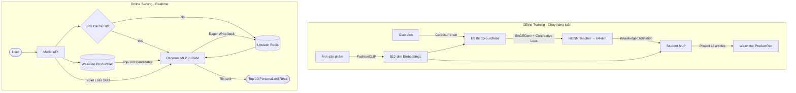

# Real-Time Personalized Fashion Recommender System

> **Paper:** "Real-time and personalized product recommendations for e-commerce through knowledge-distilled heterogeneous graph models with continual adaptation" — Tolloso et al. (2025)  
> **Dataset:** [H&M Personalized Fashion Recommendations](https://www.kaggle.com/competitions/h-and-m-personalized-fashion-recommendations/) (Kaggle)

---

## 1. Mục tiêu dự án

Xây dựng hệ thống gợi ý thời trang **thời gian thực** dựa trên kiến trúc Knowledge Distillation từ paper:

1. **HGNN Teacher** — Mã hóa quan hệ đồng mua (co-purchase) giữa sản phẩm thông qua Heterogeneous Graph Neural Network.
2. **Student MLP** — Mô hình nhẹ học chưng cất (distillation) từ HGNN, chỉ cần ảnh sản phẩm làm đầu vào.
3. **Personal MLP** — Bản sao Student MLP cho mỗi user, liên tục được fine-tune bằng Triplet Loss dựa trên tương tác thực.

---

## 2. Ràng buộc & Giới hạn Dữ liệu

### ⚠️ Giới hạn quan trọng của Dataset H&M

Paper gốc sử dụng **4 loại tương tác** (co-clicked, co-favorite, co-cart, co-purchased) từ dữ liệu nội bộ, cho phép xây dựng đồ thị heterogeneous đa cạnh với trọng số γ = [1.0, 0.5, 0.5, 0.1].

**Dataset H&M công khai chỉ có `transactions` (mua hàng)**, không có click/favorite/add-to-cart. Điều này dẫn đến:

| Khía cạnh | Paper gốc (E-commerce dataset) | Triển khai H&M (Public dataset) |
|---|---|---|
| Loại tương tác | 4 loại (click, fav, cart, purchase) | 1 loại (purchase only) |
| Số loại cạnh | 4 (heterogeneous) | 1 (homogeneous) hoặc tạo synthetic edges |
| Negative samples | Items hiển thị nhưng không click | Random negatives (không có implicit feedback) |
| Hiệu quả cá nhân hóa | F1 cải thiện +77.7% vs LightGCN | F1 cải thiện +8.4% vs best public (khiêm tốn hơn) |

**Giải pháp:** Tạo **synthetic multi-relation edges** từ tần suất mua (light/medium/heavy co-purchase) để giả lập đa cạnh.

### Ràng buộc kỹ thuật

- **Kiến trúc Serverless & Stateless:** Container inference trên Modal không giữ trạng thái. State nằm ở **Weaviate** (Vector + Metadata) và **Upstash Redis** (Personal MLP weights).
- **Latency Target:** Recommendation ≤ 50ms (bao gồm Weaviate retrieval + MLP re-rank). MLP adaptation ≤ 150ms trên CPU.
- **Bộ nhớ:** Personal MLP ~700KB/user, lưu trên Redis. LRU Cache (max 200 user) trên container RAM. TTL = 14 ngày (paper cho thấy hiệu suất giảm sau 2-3 tuần).
- **CNN Encoder:** Dùng **FashionCLIP** (512-dim) thay vì ResNet-18 (paper), cho phép cross-modal text/image search.

---

## 3. Kiến trúc hệ thống



---

## 4. Phương pháp đánh giá (theo Paper)

| Thông số | Giá trị |
|---|---|
| **Metrics** | Precision@10, Recall@10, F1@10 (× 10⁴) |
| **Ground truth T** | 12 sản phẩm mua tiếp theo |
| **Số lần chạy** | 3 random weeks → mean ± std |
| **Baselines** | Random, Last-K, CNN-EMA (no pretrain, no personalization) |
| **Ablation configs** | No Personalization, No Pre-training, No Pre-training & No Personalization, Complete |
| **Personalization windows** | Day-by-day, 1 week, 2 weeks, 3 weeks |

**Kết quả tham chiếu (Public dataset - Table 3 trong paper):**

| Model | Precision | Recall | F1 |
|---|---|---|---|
| Random baseline | 72 | 59 | 62 |
| Best public solution | 289 | 241 | 262 |
| **HGNN + 2 weeks personalization** | **312** | **285** | **298** |

---

## 5. Kế hoạch thực hiện (8 tuần — 4 thành viên)

### GIAI ĐOẠN 1: POC & Demo Tĩnh (Tuần 1–3)
*Mục tiêu: Pipeline end-to-end trên subset nhỏ (1 ngày, ~10K items, ~5K users).*

- **1.1** Setup repo, environment, data download & exploration
- **1.2** FashionCLIP embedding extraction (512-dim) + Weaviate schema & ingestion
- **1.3** Đồ thị Co-purchase + HGNN Teacher training (SAGEConv + Contrastive Loss)
- **1.4** Student MLP distillation + ingestion 64-dim vectors vào Weaviate `ProductRec`
- **1.5** Hybrid Search Engine (Text/Image → Weaviate) + Static Recommender
- **1.6** Streamlit Demo v1: Hybrid search + item-to-item recommendations
- **1.7** Modal deployment cho POC (GPU training + CPU serving)

### GIAI ĐOẠN 2: Scale & Cá nhân hóa Real-time (Tuần 4–6)
*Mục tiêu: Full 105K sản phẩm, Personal MLP + Triplet Loss adaptation.*

- **2.1** Scale data (1-week graph, full 105K articles), retrain HGNN + Student MLP
- **2.2** Personal MLP + EMA + Upstash Redis persistence + LRU Cache lifecycle
- **2.3** Triplet Loss adaptation (SGD online) + Redis write-back
- **2.4** Interaction Simulator (session replay từ test data)
- **2.5** Streamlit Demo v2: Real-time personalization + before/after comparison
- **2.6** Modal production deployment (/search, /recommend, /interact)

### GIAI ĐOẠN 3: Evaluation & Báo cáo (Tuần 7–8)
*Mục tiêu: Đánh giá khoa học theo protocol của paper.*

- **3.1** Evaluation framework: P@10, R@10, F1@10 trên 3 random weeks
- **3.2** Ablation study (4 configurations theo Table 4)
- **3.3** Hyperparameter sensitivity (alpha, SGD steps, margin, TTL, LRU size)
- **3.4** Latency & memory profiling
- **3.5** Báo cáo cuối: Delta analysis vs paper, notebook kết quả, README hoàn chỉnh

---

## 6. Tech Stack

| Layer | Công nghệ |
|---|---|
| ML Framework | PyTorch, PyTorch Geometric |
| CNN Encoder | FashionCLIP (patrickjohncyh/fashion-clip) |
| Vector DB | Weaviate Cloud (Hybrid search + KNN) |
| User State Storage | Upstash Redis (serverless, REST-based) |
| Serverless Compute | Modal (GPU training + CPU serving) |
| Frontend | Streamlit |
| Tracking | Weights & Biases |
| Language | Python 3.10+ |

---

## 7. Cấu trúc thư mục

```
fashion-recsys/
  data/               # Raw and processed data
  src/
    data/             # Data loading, preprocessing, graph construction
    models/           # HGNN, StudentMLP, PersonalMLP
    training/         # Training loops, losses (contrastive, alignment, triplet)
    search/           # Hybrid search engine (Weaviate client, FashionCLIP encoder)
    inference/        # Recommender, MLP lifecycle, user state (EMA), Redis client
    evaluation/       # Metrics, ablation, profiling
    modal_app/        # Modal serverless deployment
  app/                # Streamlit frontend
  configs/            # Hyperparameter YAML configs
  notebooks/          # Exploration & results notebooks
  tests/
  requirements.txt
  README.md
```