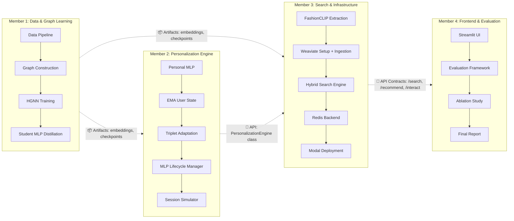

# TEAM ASSIGNMENT — Fashion Recommender System (4 Members)

> **Dự án:** Real-Time Personalized Fashion Recommender (Tolloso et al. 2025)  
> **Thời gian:** 8 tuần  
> **Nguyên tắc phân việc:** Mỗi member sở hữu một **module end-to-end** từ implementation → testing → evaluation. Giảm tối đa phụ thuộc chéo bằng **interface contracts** được định nghĩa trong Tuần 1.

---

## Tổng quan phân chia Module



> **Đường nét đứt = interface contracts**, được định nghĩa sớm (Tuần 1) để các member có thể làm việc song song với mock data/stubs.

---

## Chiến lược giảm phụ thuộc

| Cơ chế | Mô tả |
|--------|--------|
| **Interface-first design** | Tuần 1: tất cả 4 members cùng định nghĩa file contracts (function signatures, data formats, API schemas). Sau đó mỗi người tự implement. |
| **Mock artifacts** | M2 và M3 không cần chờ M1 train xong HGNN. Dùng **random embeddings** (cùng shape: 512-dim CLIP, 64-dim MLP) để phát triển song song. Thay bằng real embeddings khi M1 hoàn thành. |
| **Pluggable backends** | M2 implement `MLPLifecycleManager` với interface `StorageBackend`. Dùng `LocalDictBackend` khi dev/test, swap sang `UpstashRedisBackend` (do M3 implement) khi tích hợp. |
| **API contract file** | `contracts/api_schema.py` chứa Pydantic models cho request/response của `/search`, `/recommend`, `/interact`. M4 build UI theo contract này ngay từ đầu. |
| **Artifact file format** | Thống nhất: embeddings = `dict[str, torch.Tensor]` saved as `.pt`, checkpoints = PyTorch `state_dict` as `.pt`, configs = YAML. |

---

## Member 1 — Data Pipeline & Graph Learning

**Sở hữu:** Toàn bộ offline training pipeline, từ raw data → trained models → embeddings

### Responsibilities

| # | Task | Output |
|---|------|--------|
| 1 | Data download (Kaggle API) + EDA notebook (transaction volume, co-purchase patterns, article metadata) | `src/data/download.py`, `notebooks/01_data_exploration.ipynb` |
| 2 | POC subset extraction (1 ngày, ~10K articles, ~5K users) | `data/subset/` |
| 3 | Co-purchase graph construction (PyG `HeteroData`) — POC (1 ngày) + Full (1 tuần) | `src/data/build_graph.py` |
| 4 | Synthetic multi-relation edges (light/medium/heavy co-purchase frequency buckets) | Tích hợp trong `build_graph.py` |
| 5 | HGNN Teacher model (SAGEConv [512→256→128→64] + Contrastive Loss Eq. 2-3) | `src/models/hgnn.py`, `src/training/train_hgnn.py` |
| 6 | Student MLP distillation (Alignment Loss Eq. 4) | `src/models/student_mlp.py`, `src/training/train_student.py` |
| 7 | Hyperparameter grid search cho HGNN + Student MLP (Table 5 paper) | `configs/hgnn.yaml`, WandB logs |
| 8 | Generate & export embeddings: HGNN 64-dim cho all articles, Student MLP checkpoint | 📦 `data/processed/hgnn_embeddings.pt`, `checkpoints/student_mlp.pt` |
| 9 | Ablation config support: tạo checkpoints cho "No Pre-training" variant (random-init MLP) | `checkpoints/student_mlp_random.pt` |
| 10 | Unit tests cho graph construction + HGNN + Student MLP | `tests/test_data.py`, `tests/test_models.py` |

### 📦 Output Contracts (người khác phụ thuộc)

```python
# File: data/processed/clip_embeddings.pt  (do M3 tạo, M1 consume)
# Format: Dict[str, torch.Tensor]  # article_id -> Tensor[512], L2-normalized

# File: data/processed/hgnn_embeddings.pt  (M1 tạo)
# Format: Dict[str, torch.Tensor]  # article_id -> Tensor[64]

# File: checkpoints/student_mlp.pt  (M1 tạo)
# Format: state_dict of MLP([512, 256, 128, 64])

# File: checkpoints/hgnn.pt  (M1 tạo)
# Format: state_dict of HGNN
```

### Timeline gợi ý
- **Tuần 1–2:** Tasks 1-4 (data + graph)
- **Tuần 3–4:** Tasks 5-6 (HGNN + Student MLP trên POC)
- **Tuần 5–6:** Tasks 7-8 (full-scale retrain + hyperparameter search)
- **Tuần 7–8:** Tasks 9-10 (ablation support + tests + hỗ trợ báo cáo)

---

## Member 2 — Personalization Engine

**Sở hữu:** Toàn bộ online personalization logic, từ Personal MLP → EMA → Triplet adaptation → Simulation

### Responsibilities

| # | Task | Output |
|---|------|--------|
| 1 | Personal MLP module: deep copy từ Student MLP, serialization (torch save/load + base64) | `src/models/personal_mlp.py` |
| 2 | EMA user representation (Eq. 5): `u_t = (1-α)·u_{t-1} + α·MLP_u(h_CNN_t)` | `src/inference/user_state.py` |
| 3 | Triplet Loss adaptation (Eq. 6-7): weighted centroid, pos/neg selection, SGD in-place | `src/training/adapt_personal_mlp.py` |
| 4 | `MLPLifecycleManager` với pluggable `StorageBackend` interface: LRU Cache (max_size=200) + dirty flag + eviction | `src/inference/mlp_lifecycle.py` |
| 5 | `LocalDictBackend` implementation (cho dev/test/simulation — không cần network) | Tích hợp trong `mlp_lifecycle.py` |
| 6 | Recommender engine: 2-stage (Weaviate top-100 retrieval → Personal MLP re-rank) | `src/inference/recommender.py` |
| 7 | Interaction Simulator: session replay từ test data, hỗ trợ day-by-day + multi-week modes | `src/inference/session_simulator.py` |
| 8 | Hyperparameter sensitivity: alpha, SGD steps, margin, batch_size, personalization lifespan | Sensitivity plots + analysis |
| 9 | Config YAML cho tất cả personalization hyperparameters | `configs/personalization.yaml` |
| 10 | Unit tests cho EMA, Triplet adaptation, LRU lifecycle, Recommender | `tests/test_personalization.py` |

### 📦 Output Contracts

```python
# Class: PersonalizationEngine  (M3 sẽ wrap thành API endpoint)
class PersonalizationEngine:
    def get_recommendations(self, user_id: str, seed_article_id: str, k: int = 10) -> List[str]: ...
    def handle_interaction(self, user_id: str, article_id: str, shown_articles: List[str]) -> None: ...
    def get_user_state(self, user_id: str) -> Dict: ...  # EMA vector, interaction count, etc.

# Interface: StorageBackend  (M3 sẽ implement UpstashRedisBackend)
class StorageBackend(Protocol):
    def get(self, key: str) -> Optional[bytes]: ...
    def set(self, key: str, value: bytes, ttl_seconds: int) -> None: ...
    def delete(self, key: str) -> None: ...
    def exists(self, key: str) -> bool: ...
    def refresh_ttl(self, key: str, ttl_seconds: int) -> None: ...
```

### Cách giảm phụ thuộc
- **Không chờ M1:** Dùng random `torch.randn(512)` làm CLIP embeddings và random Student MLP checkpoint để phát triển toàn bộ pipeline. Swap real artifacts khi M1 hoàn thành.
- **Không chờ M3:** Dùng `LocalDictBackend` thay vì Redis. Dùng mock Weaviate (simple KNN trên in-memory tensor list) cho candidate retrieval.

### Timeline gợi ý
- **Tuần 1–2:** Tasks 1-3 (Personal MLP + EMA + Triplet Loss core logic)
- **Tuần 3–4:** Tasks 4-6 (Lifecycle Manager + Recommender)
- **Tuần 5–6:** Tasks 7, 9 (Simulator + configs)
- **Tuần 7–8:** Tasks 8, 10 (sensitivity analysis + tests)

---

## Member 3 — Search & Infrastructure

**Sở hữu:** FashionCLIP extraction, Weaviate, Redis backend, Modal deployment, toàn bộ infra

### Responsibilities

| # | Task | Output |
|---|------|--------|
| 1 | Project scaffolding: directory structure, `requirements.txt`, `.gitignore`, config templates | Project skeleton |
| 2 | FashionCLIP embedding extraction: image encoder (512-dim) + text encoder utility | `src/data/extract_embeddings.py`, `src/search/clip_encoder.py` |
| 3 | Weaviate schema: `Product` (512-dim CLIP + metadata, hybrid search) + `ProductRec` (64-dim MLP, Euclidean) | `src/search/weaviate_setup.py` |
| 4 | Weaviate ingestion: batch import articles + embeddings | `src/search/ingest_products.py`, `src/search/ingest_rec_embeddings.py` |
| 5 | Hybrid Search Engine: text-to-image, image-to-image, hybrid BM25+vector, metadata filters | `src/search/search_engine.py` |
| 6 | `UpstashRedisBackend` implementation (conform to M2's `StorageBackend` interface) | `src/inference/redis_client.py` |
| 7 | Modal App: GPU function (training), CPU functions (`/search`, `/recommend`, `/interact`) | `src/modal_app/app.py` |
| 8 | API contract implementation: integrate M2's `PersonalizationEngine` vào Modal endpoints | Deployed API |
| 9 | Latency & memory profiling: Weaviate queries, Redis GET/SET, LRU hit rates, end-to-end pipeline | `src/evaluation/profile.py` |
| 10 | API documentation + system architecture trong README | API docs |

### 📦 Output Contracts

```python
# API Endpoints (M4 sẽ gọi từ Streamlit)
# POST /search
#   body: {query: str, image_b64?: str, filters?: Dict, user_id?: str, alpha?: float, mode?: "semantic"|"keyword"|"hybrid"}
#   response: {results: [{article_id, score, product_name, image_path, ...}]}

# POST /recommend
#   body: {article_id: str, user_id?: str, k?: int}
#   response: {recommendations: [{article_id, score, ...}]}

# POST /interact
#   body: {user_id: str, article_id: str, shown_articles?: List[str]}
#   response: {status: str, interaction_count: int, adapted: bool}
```

### Cách giảm phụ thuộc
- **Không chờ M1:** Dùng random embeddings (512-dim, 64-dim) để setup và test Weaviate schema + ingestion ngay từ đầu. Swap real embeddings khi M1 export.
- **Không chờ M2:** Implement API endpoints với stub `PersonalizationEngine` (return random recs). Integrate real engine khi M2 hoàn thành interface.

### Timeline gợi ý
- **Tuần 1–2:** Tasks 1-4 (scaffolding + FashionCLIP + Weaviate setup)
- **Tuần 3–4:** Tasks 5-6 (Search Engine + Redis Backend)
- **Tuần 5–6:** Tasks 7-8 (Modal deployment + integration)
- **Tuần 7–8:** Tasks 9-10 (profiling + docs)

---

## Member 4 — Frontend & Evaluation

**Sở hữu:** Streamlit UI (mọi version), evaluation framework, ablation study, final report

### Responsibilities

| # | Task | Output |
|---|------|--------|
| 1 | Streamlit app skeleton: search-first UX, metadata filter sidebar, search mode toggle | `app/streamlit_app.py` |
| 2 | Search UI: text search + image upload + hybrid mode + product grid display | Search page |
| 3 | Click-to-recommend: detail panel + "You might also like" section | Recommendation panel |
| 4 | Personalization UI: before/after toggle, interaction count, adaptation status, EMA visualization | Personalization feedback |
| 5 | Wire Streamlit → Modal API (theo API contracts) | Connected demo |
| 6 | Evaluation framework: P@10, R@10, F1@10 (K=10, T=12, 3 random weeks) | `src/evaluation/metrics.py`, `src/evaluation/run_eval.py` |
| 7 | Ablation study: 4 configs (Complete, No Personalization, No Pre-training, CNN-EMA Baseline) | `src/evaluation/ablation.py` |
| 8 | Baseline implementations: Random, Last-K, CNN-EMA | Tích hợp trong `run_eval.py` |
| 9 | Results notebook: tables, plots, delta analysis vs paper Table 3 | `notebooks/03_results.ipynb` |
| 10 | Final report + presentation slides | Report + slides |

### Cách giảm phụ thuộc
- **Không chờ M3 deploy:** Build Streamlit app với **mock API responses** (hardcoded JSON matching API contract schema). Swap sang real API endpoint khi M3 deploy.
- **Không chờ M1/M2 hoàn thành:** Evaluation framework (metrics functions) là pure logic — implement và unit test ngay được với synthetic data. Chỉ cần real data khi chạy final evaluation (Tuần 7).

### Timeline gợi ý
- **Tuần 1–3:** Tasks 1-4 (Streamlit UI hoàn chỉnh với mock data)
- **Tuần 4–5:** Tasks 5-6 (API integration + Evaluation framework)
- **Tuần 6:** Tasks 7-8 (Ablation + Baselines)
- **Tuần 7–8:** Tasks 9-10 (chạy evaluation thật, report)

---

## Integration Points (chỉ 3 điểm tích hợp chính)

Toàn bộ dự án chỉ có **3 điểm tích hợp** cần sync giữa các members:

| # | Điểm tích hợp | Ai → Ai | Khi nào | Fallback nếu chậm |
|---|---------------|---------|---------|-------------------|
| **I1** | Real embeddings + checkpoints ready | M1 → M2, M3 | Tuần 4 | Mock random embeddings (cùng shape) |
| **I2** | `PersonalizationEngine` + `UpstashRedisBackend` integration | M2 + M3 | Tuần 5 | M3 dùng stub engine, M2 dùng LocalDictBackend |
| **I3** | Streamlit ↔ Modal API full connection | M3 → M4 | Tuần 6 | M4 dùng mock API responses |

```
Tuần 1 ──── Tuần 2 ──── Tuần 3 ──── Tuần 4 ──── Tuần 5 ──── Tuần 6 ──── Tuần 7 ──── Tuần 8
                                        │           │           │
                                       I1          I2          I3
                                   Embeddings   Engine     Full Demo
                                   + Ckpts    Integration  Connected
```

---

## Risks & Mitigation

| Risk | Mitigation |
|------|------------|
| M1 train HGNN chậm → block M2, M3 | Mock embeddings cho phép M2, M3 phát triển 100% logic trước. Chỉ cần swap artifact files. |
| Weaviate/Redis free tier limits | M3 dùng Weaviate Embedded (local) cho dev. Chỉ cần Cloud cho demo cuối. |
| F1 thấp hơn paper (H&M chỉ có purchase) | Expected. Document rõ trong delta analysis. Target: F1 ≈ 280-300 (×10⁴). |
| Integration bugs khi ghép modules | API contracts + unit tests ở mỗi module giúp phát hiện sớm. 2 buổi integration test: Tuần 5 và Tuần 6. |

---

## Chỉ tiêu tối thiểu

### ✅ Must-have
1. HGNN + Student MLP training pipeline hoạt động
2. Personal MLP + EMA + Triplet Loss adaptation
3. Weaviate hybrid search (text + image + filters)
4. Evaluation: P@10, R@10, F1@10 (ít nhất 1 random week)
5. Ablation study (4 configs)
6. Streamlit demo end-to-end
7. Delta analysis vs paper

### 🌟 Nice-to-have
1. Synthetic multi-relation edges
2. Full 3 random weeks evaluation
3. Personalized search re-ranking
4. Modal production deployment
5. EMA trajectory visualization (t-SNE)
