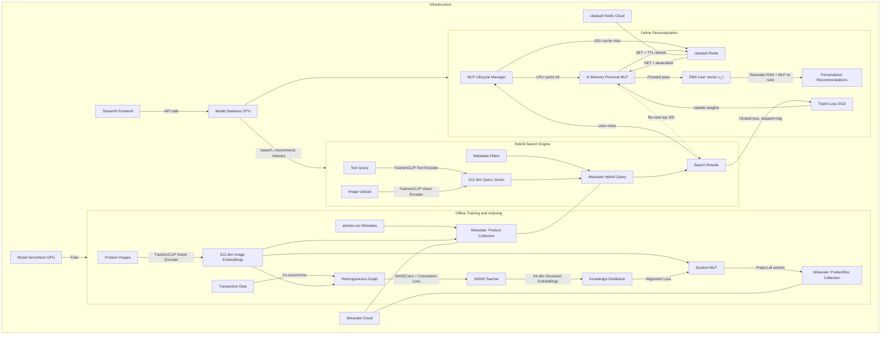
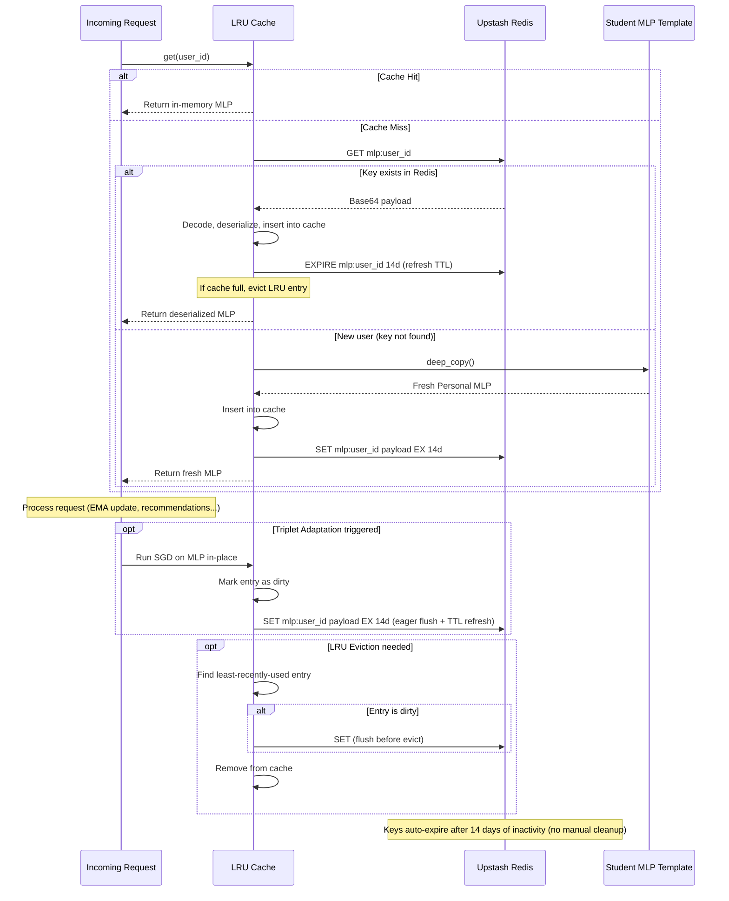
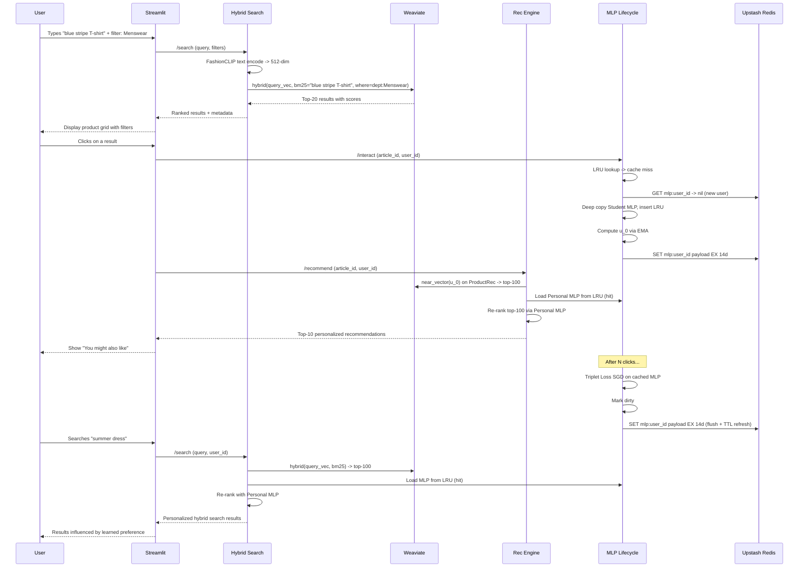

# Real-Time Personalized Fashion Recommender with Hybrid Search: Project Execution Plan

## Critical Design Constraints

- The H&M public Kaggle dataset contains **only purchase transactions** (31M transactions, 1.3M users, 105K articles). It lacks click, favorite, and add-to-cart events. Per the paper (Section 3, Table 3), this limits the heterogeneous graph to **co-purchased** edges only, or we synthetically derive pseudo-interaction types from purchase frequency/recency.
- **Weaviate as the single vector store:** All vector search (both 512-dim FashionCLIP for semantic search and 64-dim Student MLP for recommendations) is delegated to Weaviate. This replaces FAISS entirely, providing native hybrid search (vector similarity + structured metadata filtering), persistent storage, and stateless inference containers.
- **Personal MLP memory lifecycle:** Personal MLP weights (~700KB each) are persisted in **Upstash Redis** (serverless cloud Redis) and loaded into an **LRU cache** on inference containers on-demand. Redis provides sub-10ms global reads, native TTL for auto-expiring stale user states, and REST-based access ideal for serverless containers. This avoids OOM from holding all active user models in RAM and makes containers horizontally scalable and stateless.

---

## Phase 1: Proof of Concept (POC) and Simple Static Demo

**Goal:** Validate the end-to-end pipeline on a small data subset (e.g., 1 day of transactions, ~5K users, ~10K articles). Produce a working Streamlit demo with hybrid search and static (non-personalized) recommendations backed by Weaviate.

### Step 1.1: Project Scaffolding and Environment Setup

- Create project directory structure:

```
Realtime-fashion-/
  data/               # Raw and processed data
  src/
    data/             # Data loading, preprocessing, graph construction
    models/           # HGNN, StudentMLP, PersonalMLP
    training/         # Training loops, losses
    search/           # Hybrid search engine (Weaviate client, text/image encoding)
    inference/        # Recommendation engine, user state, MLP lifecycle
    modal_app/        # Modal serverless deployment
  app/                # Streamlit frontend
  configs/            # Hyperparameter YAML configs
  notebooks/          # Exploration notebooks
  tests/
  requirements.txt
  README.md
```

- **Input:** None
- **Output:** Project skeleton, `requirements.txt` with pinned deps (torch, torch-geometric, transformers, fashion-clip, weaviate-client, upstash-redis, modal, streamlit, pandas, numpy, Pillow, pyyaml, wandb)

### Step 1.2: Data Download and Initial Exploration

- Download the H&M Kaggle dataset (articles.csv, customers.csv, transactions_train.csv, images/).
- Write `src/data/download.py` to handle Kaggle API download.
- Write an exploration notebook `notebooks/01_data_exploration.ipynb` to profile the data: transaction volume by week, article counts, user activity distributions, and article metadata schema (product_type_name, colour_group_name, department_name, index_group_name, garment_group_name, etc.) -- these metadata fields will become Weaviate filterable properties.
- Select a **1-day subset** for the POC (e.g., 2020-09-15). Identify the ~5K-10K most active users and their ~10K-20K interacted articles.
- **Input:** Kaggle API credentials
- **Output:** Raw CSV files and images in `data/raw/`; a filtered subset saved to `data/subset/`

### Step 1.3: Feature Extraction with FashionCLIP (Dual-Encoder)

- Write `src/data/extract_embeddings.py`:
  - Load FashionCLIP (`patrickjohncyh/fashion-clip`) via HuggingFace Transformers.
  - **Image Encoder:** Process each product image through the vision encoder. Produce a 512-dimensional image embedding per article. Save as a tensor file mapping `article_id -> embedding`.
  - **Text Encoder (runtime utility):** Write `src/search/clip_encoder.py` with a reusable `encode_text(query: str) -> torch.Tensor[512]` function that encodes arbitrary text queries through FashionCLIP's text encoder. Include fashion-specific prompt templates (e.g., "a photo of {query}", "a fashion product: {query}") to improve retrieval quality.
  - L2-normalize all embeddings before storage so that cosine similarity can be used in Weaviate's vector index.
- For the POC subset, run locally or on Modal (T4 GPU).
- **Input:** Product images from `data/raw/images/` (JPEG, 224x224)
- **Output:** `data/processed/clip_embeddings.pt` (dict: `{article_id: torch.Tensor[512]}`, L2-normalized); `src/search/clip_encoder.py` (text encoding utility)

### Step 1.3b: Weaviate Schema Design and Product Catalog Ingestion

- Write `src/search/weaviate_setup.py`:
  - **Weaviate instance:** For POC, use Weaviate Embedded (in-process, zero-infra) or Weaviate Cloud (WCD) sandbox. For production (Phase 2+), use Weaviate Cloud or a Docker container on a persistent VM.
  - **Schema -- `Product` collection** (for hybrid search):
    - Named vector: `clip_embedding` (512-dim, cosine distance) -- the FashionCLIP image embedding.
    - Properties (filterable metadata from articles.csv):
      - `article_id` (text, tokenization: field)
      - `product_name` (text, tokenization: word -- enables BM25 keyword search)
      - `product_type_name` (text, tokenization: field)
      - `product_group_name` (text, tokenization: field)
      - `colour_group_name` (text, tokenization: field)
      - `department_name` (text, tokenization: field)
      - `index_group_name` (text, tokenization: field)
      - `garment_group_name` (text, tokenization: field)
      - `detail_desc` (text, tokenization: word -- enables BM25 on descriptions)
      - `image_path` (text)
    - Weaviate's built-in inverted index on text properties enables **hybrid search**: combine vector similarity with BM25 keyword matching and metadata filters in a single query.
  - **Schema -- `ProductRec` collection** (for graph-aware recommendations, added in Step 1.6b):
    - Named vector: `mlp_embedding` (64-dim, L2/Euclidean distance -- per paper, Euclidean is preferred in low-dim spaces).
    - Properties: `article_id` (text).
- Write `src/search/ingest_products.py`:
  - Batch-import all POC subset articles into the `Product` collection with their FashionCLIP embeddings and metadata.
  - Use Weaviate's batch import API with rate-limited batches of 100 objects.
  - Verify ingestion with a count query and a test vector search.
- **Input:** `data/processed/clip_embeddings.pt`, `data/subset/articles.csv`
- **Output:** Populated Weaviate `Product` collection (POC subset: ~10K-20K objects)

### Step 1.4: Heterogeneous Graph Construction

- Write `src/data/build_graph.py`:
  - From the transaction data, build an **item-item co-occurrence graph**:
    - For each user, take all pairs of purchased articles within a session/time window.
    - Edge weight = number of distinct users who co-purchased both items.
  - Since the H&M dataset only has purchases, create a **single edge type** ("co-purchased") for the POC. (Phase 2 will explore synthetic multi-relation edges derived from purchase frequency buckets.)
  - Store as a PyTorch Geometric `HeteroData` object.
  - Node features = FashionCLIP embeddings (512-dim).
- **Input:** `data/subset/transactions.csv`, `data/processed/clip_embeddings.pt`
- **Output:** `data/processed/graph_poc.pt` (PyG HeteroData object)

### Step 1.5: HGNN Teacher Model Training

- Write `src/models/hgnn.py`:
  - Implement the HGNN using `SAGEConv` from PyG (as per paper: Equation 1).
  - Architecture: `[512, 256, 128, 64]` (3 SAGEConv layers, ReLU activation).
  - For heterogeneous multi-relation support, use separate SAGEConv per edge type with mean aggregation across relations (even if POC has only 1 type, the code should generalize).
- Write `src/training/train_hgnn.py`:
  - Implement the **contrastive loss** (Equation 2-3 from the paper):
    - For each edge (p, q) with weight a: `a * ||h_p - h_q||^2`
    - Negative sampling: random pairs not in edge set, `|E-| = |E+|`.
    - Loss weights gamma: `[1.0, 0.5, 0.5, 0.1]` per relation type.
  - Neighbor sampling: `num_neighbors=[8, 8, 8]`, `batch_size=128`.
  - Early stopping with patience=5.
  - Log to Weights & Biases.
- **Input:** `data/processed/graph_poc.pt`
- **Output:** Trained HGNN checkpoint `checkpoints/hgnn_poc.pt`; structural embeddings `data/processed/hgnn_embeddings_poc.pt` (dict: `{article_id: torch.Tensor[64]}`)

### Step 1.6: Student MLP Knowledge Distillation

- Write `src/models/student_mlp.py`:
  - Simple MLP: `[512, 256, 128, 64]` with ReLU.
  - Input: FashionCLIP embedding (512-dim). Output: 64-dim embedding aligned to HGNN space.
- Write `src/training/train_student.py`:
  - Implement the **alignment loss** (Equation 4): MSE between `MLP(h_CNN)` and `HGNN(h_CNN, E+)` for all nodes.
  - Train on all graph nodes (HGNN is frozen, only MLP weights update).
- **Input:** `data/processed/clip_embeddings.pt`, `data/processed/hgnn_embeddings_poc.pt`
- **Output:** Trained Student MLP checkpoint `checkpoints/student_mlp_poc.pt`

### Step 1.6b: Ingest Student MLP Embeddings into Weaviate

- Write `src/search/ingest_rec_embeddings.py`:
  - Load the trained Student MLP, project all article FashionCLIP embeddings through it to get 64-dim vectors.
  - Batch-import these into the Weaviate `ProductRec` collection with Euclidean distance metric.
  - This collection is used for graph-aware KNN recommendations (the paper's recommendation step).
- **Input:** `checkpoints/student_mlp_poc.pt`, `data/processed/clip_embeddings.pt`
- **Output:** Populated Weaviate `ProductRec` collection (POC subset)

### Step 1.7: Hybrid Search Engine + Static Recommendation Engine

- Write `src/search/search_engine.py`:
  - **HybridSearchEngine class** backed by Weaviate, supporting three search modes:
    1. **Text-to-Image (vector):** Encode text query via FashionCLIP text encoder -> 512-dim, query the `Product` collection's `clip_embedding` vector using `near_vector`.
    2. **Image-to-Image (vector):** Encode uploaded image via FashionCLIP vision encoder -> 512-dim, query same collection with `near_vector`.
    3. **Hybrid search (vector + BM25):** Use Weaviate's native `hybrid` query combining vector similarity (FashionCLIP) with BM25 keyword matching on `product_name` and `detail_desc`. Tunable `alpha` parameter (0=pure BM25, 1=pure vector, 0.7=default blend).
  - **Metadata filtering** is native to Weaviate -- pass `where` filters on any property (e.g., `colour_group_name == "Blue"`, `department_name == "Menswear"`). No over-retrieval or post-filtering needed. Example:
    ```python
    collection.query.hybrid(
        query="summer dress",
        filters=Filter.by_property("colour_group_name").equal("Blue"),
        alpha=0.7,
        limit=20,
        return_metadata=MetadataQuery(score=True),
    )
    ```
  - Return ranked results with article IDs, similarity/hybrid scores, and full metadata.
- Write `src/inference/recommender.py`:
  - **Recommender class** backed by the `ProductRec` Weaviate collection:
    - For a given seed article (from a search result click), look up its 64-dim MLP embedding, query Weaviate `ProductRec` with `near_vector` for K=10 nearest neighbors using Euclidean distance.
    - The inference container holds **no index in memory** -- all vector search is delegated to Weaviate.
- The two systems serve complementary roles: **search finds what the user is looking for** (cross-modal + keyword retrieval in CLIP space); **recommendations surface related items the user hasn't thought of** (graph-aware collaborative signals in MLP space).
- **Input:** Weaviate `Product` and `ProductRec` collections, `src/search/clip_encoder.py`
- **Output:** `HybridSearchEngine` (text/image + filters -> top-K articles); `Recommender` (seed article -> top-K related articles)

### Step 1.8: Streamlit Static Demo (v1) -- Hybrid Search + Recommendations

- Write `app/streamlit_app.py` with a **search-first UX flow**:
  - **Search bar** (top of page): user types a natural language query (e.g., "red summer dress", "men's denim jacket"). Results displayed as a scrollable image grid (top-20) with article name, type, color, and hybrid score.
  - **Metadata filter sidebar**: dropdowns for colour_group_name, department_name, product_type_name, index_group_name. Filters are passed as Weaviate `where` clauses alongside the vector/hybrid query.
  - **Search mode toggle**: "Semantic" (pure vector), "Keyword" (pure BM25), "Hybrid" (blended). Slider for alpha blending weight.
  - **Image upload** (alternative input): user uploads a photo of a fashion item. System performs image-to-image search and displays visually similar products.
  - **Click-to-recommend**: when user clicks any search result, a detail panel opens showing the product image, metadata, and a "You might also like" section with 10 recommendations from the Weaviate `ProductRec` collection (graph-aware suggestions distinct from the search results).
  - **Side-by-side comparison panel** (optional toggle): show "Visually Similar (CLIP)" vs "Also Purchased Together (Graph)" to illustrate the difference between the two embedding spaces.
  - No personalization yet -- purely stateless search + item-to-item recommendations.
- **Input:** HybridSearchEngine, Recommender, article metadata, product images
- **Output:** Running Streamlit app on `localhost:8501`

### Step 1.9: Modal Deployment (POC)

- Write `src/modal_app/app.py`:
  - Define a Modal `App` with:
    - A GPU function for HGNN + Student MLP training (T4).
    - A **stateless** CPU function for serving **hybrid search** via a FastAPI `/search` endpoint. This container holds only the FashionCLIP text/image encoder in memory and queries Weaviate externally. No vector index in memory.
    - A **stateless** CPU function for serving **recommendations** via a `/recommend` endpoint. Queries the `ProductRec` collection in Weaviate. No index in memory.
  - **Weaviate connectivity:** Weaviate runs as a separate service (WCD sandbox for POC, or a Docker sidecar). Modal containers connect via the Weaviate Python client with the cluster URL and API key passed as `modal.Secret`.
  - Model checkpoints stored in a Modal Volume (`vol_checkpoints`).
- **Input:** All training scripts, checkpoints, Weaviate cluster URL
- **Output:** Deployed Modal endpoints (`/search`, `/recommend`); Streamlit app updated to call the Modal API

---

## Phase 2: Full Scale and Real-Time Continual Personalization

**Goal:** Scale to a 1-week training graph (~full dataset slice), implement per-user Personal MLP with Triplet Loss adaptation, EMA-based user representation, and the Upstash Redis + LRU cache lifecycle for memory-safe Personal MLP management.

### Step 2.1: Full-Scale Data Processing

- Scale the data pipeline from Step 1.2-1.4 to a **1-week window** of transactions (as paper specifies: "one week of data for training").
  - Select a representative week (e.g., 2020-09-07 to 2020-09-13).
  - Build the full co-purchased graph over that week. Expected: ~50K-80K article nodes, millions of edges.
- Extract FashionCLIP embeddings for **all 105K articles** (batch on Modal A10G GPU, ~2-3 hours).
- **Re-ingest the full catalog into Weaviate:**
  - Delete and recreate both `Product` and `ProductRec` collections with full data.
  - Batch-import all 105K articles with 512-dim FashionCLIP vectors and metadata into `Product`.
  - At 105K objects, Weaviate's HNSW index provides sub-5ms vector search with no tuning needed. Adjust `efConstruction` and `ef` if latency is above target.
- Construct the full heterogeneous graph.
- Optionally derive **synthetic multi-relation edges** from the purchase-only data:
  - "light co-purchase" (1 co-purchaser), "medium co-purchase" (2-5), "heavy co-purchase" (6+) -- to simulate heterogeneous edge types and leverage the gamma-weighted loss.
- **Input:** Full `transactions_train.csv`, all product images
- **Output:** `data/processed/clip_embeddings_full.pt`, `data/processed/graph_full_week.pt`, fully populated Weaviate `Product` collection (105K objects)

### Step 2.2: Full HGNN + Student MLP Training on Modal

- Retrain the HGNN on the full 1-week graph using Modal GPU (T4 or A10G).
  - Expected training time: ~1.5 hours (as per paper Table 1).
  - Hyperparameter grid search (Table 5 from paper):
    - Structural layers: `[512, 256, 128, 64]` vs `[512, 256, 256, 128, 64]`
    - Neighborhood aggregation: sum vs mean
    - Learning rate: `{1e-2, 1e-3, 1e-4, 1e-5}`
    - Weight decay: `{1e-5, 1e-6, 0}`
    - Contrastive margin: `{1, 100}`
- Retrain Student MLP via distillation on the full node set.
- After Student MLP training, project all 105K articles and **re-ingest 64-dim embeddings** into the `ProductRec` Weaviate collection.
- **Input:** `data/processed/graph_full_week.pt`, `data/processed/clip_embeddings_full.pt`
- **Output:** `checkpoints/hgnn_full.pt`, `checkpoints/student_mlp_full.pt`, `data/processed/hgnn_embeddings_full.pt`, updated `ProductRec` collection in Weaviate

### Step 2.3: Personal MLP + EMA with Upstash Redis Persistence and LRU Cache

- Write `src/models/personal_mlp.py`:
  - The Personal MLP architecture is identical to the Student MLP (`[512, 256, 128, 64]`).
  - On first visit, a new user's Personal MLP is initialized as a **deep copy** of the trained Student MLP.
  - Serialization helpers: `serialize_state(mlp) -> bytes` and `deserialize_state(bytes) -> mlp` using `torch.save`/`torch.load` with `io.BytesIO`. Each serialized MLP is ~700KB. Base64-encode the bytes for storage in Redis (Redis REST API works with strings).
- Write `src/inference/redis_client.py` -- **Upstash Redis connection wrapper**:
  - Use the `upstash-redis` Python package (REST-based, no persistent TCP connections).
  - Initialize with `UPSTASH_REDIS_REST_URL` and `UPSTASH_REDIS_REST_TOKEN` from environment / `modal.Secret`.
  - Provides `get(key) -> bytes | None`, `set(key, value, ttl_seconds)`, `delete(key)`, `exists(key)` methods.
  - All values are base64-encoded byte strings (to safely store binary MLP state_dict blobs over the REST API).
  - **Upstash free tier note:** 1MB max value size, sufficient for ~700KB serialized MLPs. 10K commands/day on free tier; upgrade to Pay-as-you-go ($0.2/100K commands) for production.
- Write `src/inference/mlp_lifecycle.py` -- the **MLP lifecycle manager**:
  - **Storage tier -- Upstash Redis**:
    - Key pattern: `mlp:{user_id}` (string).
    - Value: base64-encoded serialized bytes containing `{"mlp_state_dict": ..., "ema_vector": ..., "interaction_count": ..., "interaction_batch": [...]}`.
    - **TTL (Time-To-Live):** Each key is written with a configurable TTL (default: 14 days). This auto-expires stale user states -- matching the paper's finding that personalization degrades after 2-3 weeks. No manual cleanup needed.
    - **Touch-on-access:** On every read, refresh the TTL (`EXPIRE` command) to keep active users alive. Only truly inactive users expire.
  - **Hot tier -- LRU cache** (in-process, per-container):
    - Custom `OrderedDict`-based LRU with a configurable `max_size` (default: 200 users per container).
    - Each cache entry holds: the deserialized `nn.Module` (Personal MLP), the EMA vector (`torch.Tensor[64]`), interaction count, interaction batch buffer, and a dirty flag.
    - The LRU eviction policy ensures the container never exceeds `max_size * 700KB ≈ 140MB` of MLP memory. With the container's base memory (~500MB for PyTorch + FashionCLIP encoder), total stays safely under 1GB.
  - **Lifecycle flow:**
    1. **Load (cache miss):** On request for `user_id`, check LRU cache. If miss, `GET mlp:{user_id}` from Upstash Redis (typical latency: 5-15ms globally via REST). Deserialize, insert into LRU cache, refresh TTL. If the key does not exist in Redis (new user), create a new Personal MLP from the Student MLP template and `SET` it in Redis with TTL.
    2. **Use:** Run forward pass / adaptation on the in-memory MLP.
    3. **Write-back (dirty flush):** After any triplet adaptation modifies weights, mark the cache entry as dirty. Flush dirty entries to Upstash Redis:
      - **Eager flush:** Immediately after adaptation completes. `SET mlp:{user_id} <payload> EX <ttl>`. Adds ~5-15ms network write. Preferred for correctness.
      - **Lazy flush:** On LRU eviction or periodically (lower latency, risk of losing recent adaptation on container crash).
      - Use **eager flush** as default; lazy flush as a config option.
    4. **Evict:** When LRU cache is full and a new user arrives, evict the least-recently-used entry. If dirty, flush to Redis first.
  - **Concurrency:** Modal containers are single-request by default (no concurrent access to the same MLP). If scaling to concurrent containers, Redis acts as the single source of truth. Stale-read risk is acceptable since adaptation is incremental and MLP updates are additive.
  - **Pluggable backend:** The `MLPLifecycleManager` accepts a storage backend interface (`UpstashRedisBackend` for production, `LocalDictBackend` for offline simulation in Step 2.5). This makes testing and batch evaluation possible without network overhead.
- Write `src/inference/user_state.py`:
  - Implement EMA user representation (Equation 5 from the paper):
    ```
    u_t = (1 - alpha) * u_{t-1} + alpha * MLP_u(h_CNN_t)
    ```
  - `u_0` = MLP projection of the first interacted article.
  - Alpha is a tunable hyperparameter (search: 0.1 to 1.0).
  - The EMA vector is stored alongside the MLP state in Redis.
- Update `src/inference/recommender.py`:
  - For cold users (no Personal MLP yet), recommendations come from the global `ProductRec` Weaviate collection (Student MLP embeddings).
  - For warm users (with a Personal MLP), use a **two-stage approach**:
    1. Retrieve top-100 candidates from Weaviate `ProductRec` using `near_vector` with the user's EMA vector.
    2. Re-rank: project each candidate's FashionCLIP embedding through the user's Personal MLP, compute Euclidean distance to the user's EMA vector, sort by distance.
  - This avoids needing a per-user Weaviate collection; the global collection serves as the candidate generator, and the Personal MLP re-ranks locally.
- **Input:** `checkpoints/student_mlp_full.pt`, user interaction stream
- **Output:** `MLPLifecycleManager` class; per-user MLP + EMA state persisted in Upstash Redis; personalized top-K recommendations

### Step 2.4: Triplet Loss Continual Personalization with Upstash Redis Write-Back

- Write `src/training/adapt_personal_mlp.py`:
  - Implement the triplet loss adaptation (Equations 6-7 from the paper):
    1. Collect a batch `B_u` of recent user interactions (batch_size: 1-9). The interaction batch buffer is stored in the user's Redis entry and LRU cache entry.
    2. Compute weighted centroid `h_wc` of interacted article FashionCLIP embeddings (weight by interaction type; since H&M has only purchases, weight=1 or use recency weighting).
    3. Select negative examples: articles shown but not interacted with (search results displayed but not clicked).
    4. Load the user's Personal MLP from the LRU cache (or Upstash Redis on cache miss).
    5. Run a few SGD steps (1-80, tunable) on the Personal MLP minimizing:
      `L_tri = max(0, ||MLP_u(h_wc) - MLP_u(h_pos)||^2 - ||MLP_u(h_wc) - MLP_u(h_neg)||^2 + epsilon)`
    6. Margin epsilon: {1, 100, infinity}.
    7. After adaptation: mark the LRU entry as dirty, eager flush to Upstash Redis (`SET mlp:{user_id} <payload> EX <ttl>`). The TTL is refreshed on every write, keeping the user alive.
  - Trigger adaptation every N interactions (paper: every 1-9 interactions).
  - After adaptation, re-rank recommendations using the updated Personal MLP (Step 2.3's two-stage approach). No need to update any Weaviate collection -- the global `ProductRec` is unchanged; only the re-ranking weights differ.
- Hyperparameter grid for online personalization (Table 5 from paper):
  - SGD steps: `{1, 2, 3, 5, 10, 20, 35, 50}`
  - Learning rate: `{1e-3, 1e-4, 1e-5}`
  - Alpha (EMA): `{0.1, 0.3, 0.5, 0.7, 0.9}`
  - Batch size: `{3, 5, 7}`
  - Margin: `{1, 100}`
- **Input:** User interaction stream (article clicks), user's Personal MLP (from LRU/Upstash Redis)
- **Output:** Updated Personal MLP weights flushed to Upstash Redis (with TTL refresh), updated EMA vector

### Step 2.5: Interaction Simulation Engine

- Write `src/inference/session_simulator.py`:
  - Replay historical user sessions from the "simulated future" data (the week following the training week).
  - For each user session, simulate the sequential interaction flow:
    1. User arrives -> MLPLifecycleManager creates a fresh Personal MLP (deep copy of Student MLP), stores in backend.
    2. First interaction -> compute `u_0` via EMA.
    3. Every subsequent interaction -> update EMA, trigger triplet adaptation every N clicks with backend write-back.
    4. After each interaction, generate top-K recommendations (two-stage: Weaviate retrieval + Personal MLP re-ranking) and compare against ground truth (next T=12 purchases).
  - Support two modes from the paper:
    - **Day-by-day cold start:** Delete the user's Redis key (or local dict entry) at end of each day.
    - **Multi-week personalization:** Keep the user's state across days.
  - For batch simulation, use `LocalDictBackend` to avoid network overhead. For production-realistic testing, use `UpstashRedisBackend`. The `MLPLifecycleManager`'s pluggable backend (defined in Step 2.3) makes this seamless.
- **Input:** Test transaction data (simulated future), trained models, Weaviate
- **Output:** Per-user recommendation logs, ground-truth comparisons

### Step 2.6: Search-to-Recommendation Pipeline Integration

- Write `src/search/personalized_search.py`:
  - Connect the hybrid search engine with the personalization pipeline so that **search interactions drive adaptation**:
    1. User performs a text or image search (or hybrid) -> system queries Weaviate `Product` collection -> returns results.
    2. User clicks on a search result -> that click is treated as a **positive interaction** feeding the EMA update and triplet adaptation batch.
    3. Search results that are displayed but not clicked serve as **hard negative examples** for the triplet loss (better than random negatives).
  - Implement **personalized re-ranking of search results**: after the initial Weaviate hybrid retrieval (top-100), optionally re-rank using the user's Personal MLP:
    - Re-ranking score: `score = lambda * weaviate_score + (1 - lambda) * sim_mlp(u_t, MLP_u(item))`
    - Lambda starts at 1.0 (pure search) and decays toward 0.5 as the user accumulates more interactions (the Personal MLP becomes more reliable).
  - The user's Personal MLP is loaded from the LRU cache (or Upstash Redis on miss) for re-ranking. Re-ranking top-100 candidates through a shallow MLP is <5ms on CPU.
- **Input:** HybridSearchEngine (Weaviate), Personal MLP (LRU/Upstash Redis), user interaction stream
- **Output:** Personalized search results, enriched interaction batches for adaptation

### Step 2.7: Streamlit Interactive Demo (v2) -- Full Loop

- Upgrade `app/streamlit_app.py` with the complete search-to-personalization loop:
  - **Search-first flow:** User searches (text/image/hybrid with metadata filters) -> clicks results -> system adapts -> next search/recommendations are personalized.
  - **Visual feedback on personalization:**
    - Sidebar: interaction count, EMA trajectory visualization (t-SNE or PCA of user vector over time), Personal MLP adaptation status, cache indicator (LRU hit vs Upstash Redis fetch), Redis TTL remaining.
    - Main panel: search results with a subtle "personalization influence" indicator (how much re-ranking shifted results vs pure Weaviate order).
    - "You might also like" panel below search results, powered by the two-stage recommender (Weaviate retrieval + Personal MLP re-ranking), updates after each click.
  - **Before/after toggle:** compare "Generic Search Results" (pure Weaviate hybrid) vs "Personalized Results" (re-ranked by Personal MLP).
  - **Metadata filter persistence:** selected filters persist across searches within a session.
  - Show live metrics (Precision, Recall, F1) updating as the session progresses.
- Wire the Streamlit app to the Modal API.
- **Input:** Full search + recommendation engine with personalization and MLP lifecycle
- **Output:** Interactive Streamlit demo with hybrid-search-driven real-time adaptation

### Step 2.8: Modal Production Deployment

- Update `src/modal_app/app.py`:
  - **GPU function:** On-demand HGNN retraining (scheduled weekly). After training, re-ingest 64-dim embeddings into Weaviate `ProductRec`.
  - **CPU function `/search`:** Accepts text query, base64-encoded image, or both + optional metadata filters + optional `user_id` for personalized re-ranking. Loads FashionCLIP encoder. Queries Weaviate. If `user_id` provided, loads Personal MLP from LRU/Upstash Redis for re-ranking.
  - **CPU function `/recommend`:** Accepts `article_id` + `user_id`. Queries Weaviate `ProductRec` for candidate retrieval. If `user_id` has a Personal MLP, loads it from LRU/Upstash Redis for re-ranking.
  - **CPU function `/interact`:** Logs a user click. Updates EMA. Accumulates interaction batch. Triggers triplet adaptation if batch threshold reached. Flushes updated MLP to Upstash Redis with TTL refresh.
  - **Infrastructure:**
    - **Upstash Redis** -- serverless Redis instance for all user MLP states + EMA vectors + interaction batches. Connected via REST API (no persistent connections, no connection pool -- ideal for serverless). Key pattern: `mlp:{user_id}`. All keys have TTL (default 14 days).
    - `modal.Volume("checkpoints")` -- stores HGNN/Student MLP checkpoints and FashionCLIP embeddings tensor.
    - `modal.Secret("weaviate-credentials")` -- Weaviate cluster URL + API key.
    - `modal.Secret("upstash-redis")` -- `UPSTASH_REDIS_REST_URL` + `UPSTASH_REDIS_REST_TOKEN`.
    - Container image: includes torch, weaviate-client, upstash-redis, transformers, fashion-clip. ~2GB image, cached.
    - Container config: `memory=1024` (1GB -- sufficient for PyTorch + FashionCLIP + LRU cache of 200 MLPs).
- **Input:** All model code, checkpoints, Weaviate cluster, Upstash Redis instance
- **Output:** Production Modal deployment with `/search`, `/recommend`, `/interact` endpoints; all containers fully stateless (LRU cache is ephemeral, reconstructable from Upstash Redis on any container)

---

## Phase 3: Evaluation, Optimization, and Scientific Reporting

**Goal:** Rigorous evaluation matching the paper's protocol, ablation studies, performance optimization (including Weaviate tuning and LRU sizing), and documentation.

### Step 3.1: Evaluation Framework

- Write `src/evaluation/metrics.py`:
  - **Recommendation metrics:** Precision@K, Recall@K, F1@K (K=10, T=12 ground truth, as per paper).
  - **Search/retrieval metrics:** MRR (Mean Reciprocal Rank), nDCG@K, Hit Rate@K -- evaluated by using article text metadata (product name + color + type) as pseudo-queries against image embeddings, with ground truth being the exact article match and same-category articles.
  - **Hybrid search quality:** Compare pure-vector vs pure-BM25 vs hybrid (varying alpha) on the same pseudo-query set.
  - Run evaluation across 3 random training weeks (as paper: "three random weeks are sampled").
  - Report mean and standard deviation across the 3 runs.
- Write `src/evaluation/run_eval.py`:
  - Orchestrate the full evaluation pipeline:
    1. For each of 3 random weeks: train HGNN + Student MLP, ingest embeddings into Weaviate.
    2. Simulate user sessions on the following days (using `LocalDictBackend` to avoid Upstash Redis network overhead in batch evaluation).
    3. Evaluate in all settings: No Personalization, Daily Personalization, 1-week, 2-week, 3-week personalization.
  - Compare against baselines:
    - Random baseline
    - Last-K baseline
    - CNN-EMA baseline (no pretraining, no personalization -- just raw FashionCLIP + EMA)
  - **Search evaluation:** Benchmark the hybrid search engine independently -- measure retrieval quality (MRR, nDCG) and latency (ms per query) for each search mode (vector, BM25, hybrid).
- **Input:** Full pipeline, test data
- **Output:** Results table comparable to paper Table 3, saved as CSV/JSON; search quality report

### Step 3.2: Ablation Studies

- Replicate the ablation configurations from paper Table 4:
  - **No Personalization (Cold-Start):** Student MLP + EMA only, no triplet adaptation. Recommendations from global `ProductRec` Weaviate collection.
  - **No Pre-training:** Random-initialized MLP (no HGNN distillation), only triplet adaptation.
  - **No Pre-training and No Personalization:** Raw FashionCLIP + EMA baseline.
  - **Complete model:** HGNN + distillation + personalization.
- **Input:** Evaluation framework, trained models
- **Output:** Ablation results table, analysis comparing component contributions

### Step 3.3: Latency and Memory Profiling

- Profile the system's real-time performance:
  - **Weaviate search latency:** Vector-only, BM25-only, and hybrid queries at 105K objects (target: <10ms p50, <30ms p99).
  - **Weaviate + re-ranking latency:** Weaviate retrieval (top-100) + Personal MLP re-ranking (target: <50ms total).
  - **Weaviate recommendation latency:** `ProductRec` KNN at 105K objects (target: <5ms).
  - **MLP lifecycle latency:**
    - LRU cache hit: ~0ms (in-process dict lookup).
    - Upstash Redis GET (cache miss): measure actual round-trip latency (~5-15ms globally via REST, varies by region proximity).
    - Upstash Redis SET (eager flush): ~5-15ms.
    - Base64 encode/decode overhead for ~700KB payloads: measure (expected <1ms).
  - **LRU cache hit rate:** Simulate realistic user traffic patterns and measure hit rates at different `max_size` values (50, 100, 200, 500). Plot hit rate vs memory usage.
  - Recommendation latency per user (target: ~1.5ms on CPU for warm cache + Weaviate retrieval).
  - Triplet adaptation latency (target: 3-150ms on CPU, excluding Modal.Dict write-back).
  - Memory per Personal MLP (target: ~700KB serialized).
  - HGNN+MLP training time on Modal GPU (target: ~1.5h).
- Write `src/evaluation/profile.py` with `torch.profiler` and wall-clock timing.
- **Input:** Running search + inference engine + Weaviate + Upstash Redis
- **Output:** Latency/memory report with Weaviate query latencies, Upstash Redis round-trip times, LRU hit rate curves, and end-to-end pipeline timing

### Step 3.4: Hyperparameter Sensitivity Analysis

- Analyze sensitivity of key hyperparameters:
  - EMA alpha vs recommendation quality.
  - SGD steps vs adaptation time and F1.
  - Triplet margin epsilon vs embedding space separation.
  - Personalization lifespan (1 day, 1 week, 2 weeks, 3 weeks).
  - Weaviate hybrid alpha (BM25 vs vector blend) vs search retrieval quality.
  - **LRU cache max_size** vs hit rate vs container memory usage.
  - **Redis TTL duration** (7 days, 14 days, 21 days) vs personalization quality vs storage usage.
  - **Redis write-back strategy** (eager vs lazy) vs data durability vs latency.
- Generate plots for each analysis.
- **Input:** Evaluation framework, hyperparameter sweep results
- **Output:** Sensitivity analysis plots and tables

### Step 3.5: Final Documentation and Reporting

- Write a comprehensive `README.md` covering architecture, setup, reproduction steps.
- Generate a final results notebook `notebooks/03_results.ipynb` with all tables, plots, and analysis.
- Document the delta between the paper's approach (ResNet-18 + proprietary multi-interaction data + in-memory KNN) and this implementation (FashionCLIP + purchase-only public data + Weaviate hybrid search + Upstash Redis MLP lifecycle).

---

## Architecture Diagram




## Personal MLP Memory Lifecycle




## User Experience Flow




## Key Technical Decisions

- **Weaviate replaces FAISS:** All vector search is externalized to Weaviate, making Modal inference containers fully stateless (no in-memory indices). Weaviate provides native hybrid search (BM25 + vector), structured metadata filtering via `where` clauses, persistent storage, and sub-10ms HNSW lookups at 105K scale. Two separate collections serve different purposes: `Product` (512-dim CLIP, hybrid search) and `ProductRec` (64-dim MLP, Euclidean KNN for recommendations).
- **Upstash Redis + LRU cache for Personal MLPs:** Personal MLP weights are durably stored in Upstash Redis (serverless cloud Redis, REST-based) and hot-loaded into a per-container LRU cache. This solves the OOM problem (only `max_size` MLPs in memory at once, ~140MB for 200 users) while maintaining sub-millisecond access for recently active users via LRU hits and ~5-15ms access via Redis on cache miss. Redis's native TTL auto-expires stale user states after 14 days (matching the paper's finding that personalization degrades after 2-3 weeks), eliminating manual cleanup. The REST-based `upstash-redis` client requires no persistent TCP connections -- ideal for Modal's serverless containers. Dirty entries are eagerly flushed on adaptation to ensure durability.
- **FashionCLIP vs ResNet-18:** The paper uses ResNet-18 for CNN embeddings. We substitute FashionCLIP for richer fashion-domain visual-text embeddings (512-dim, same dimensionality). FashionCLIP's dual-encoder enables cross-modal semantic search that ResNet-18 cannot provide.
- **Two-stage personalized recommendations:** Global Weaviate `ProductRec` serves as the candidate generator (top-100 via KNN). The user's Personal MLP re-ranks these candidates locally. This avoids per-user Weaviate collections while still providing personalized ordering.
- **Search-Personalization Bridge:** Search clicks are the primary user interaction signal. Clicked results become positive examples; displayed-but-not-clicked results become hard negatives for triplet loss.
- **Euclidean distance for recommendations:** Paper explicitly uses Euclidean in the 64-dim MLP space. Weaviate's `ProductRec` collection is configured with L2 distance. For the 512-dim CLIP search space, cosine distance is used since CLIP is trained with a cosine-based contrastive objective.
- **Stateless containers:** Modal CPU containers hold only the FashionCLIP encoder (~400MB) and the LRU cache (configurable, ephemeral). All persistent state lives in Weaviate (product catalog + vectors) and Upstash Redis (user MLP weights + EMA + session state). Containers can be freely scaled, restarted, or replaced -- any container can serve any user by fetching state from Redis on demand.

